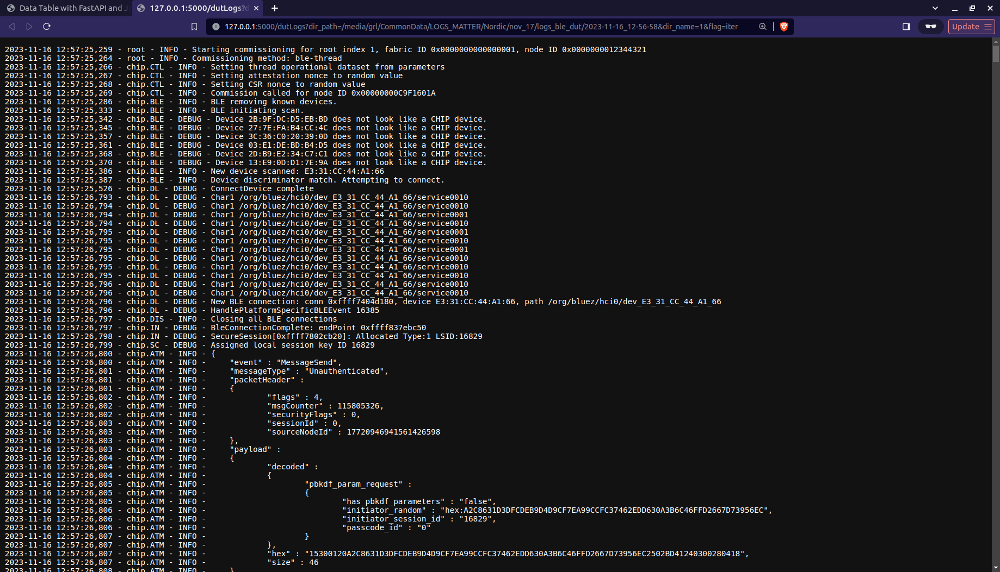

# Project Setup
First step in to get the python environment ready. We can follow these steps

Clone the Repo; build the matter environment; activate the environment; finally build the python environment; using the commands below

```
git clone  https://github.com/project-chip/connectedhomeip.git

cd connectedhomeip

source scripts/bootstrap.sh

source scripts/activate.sh

scripts/build_python.sh -m platform -d true -i <name_of_python_environment>

source <name_of_python_environment>/bin/activate
```
After the environment setup is completed  place the contents from root of this project to the path of ```<path_to_cloned_repo>/connectedhomeip/src/python_testing``` and navigate to this path

To run Either the LOG Display web app or Matter_QA scripts we need to run setup.py to install a few libraries for that run 

```python setup.py install``` 

The reliability scripts will be present in the path ```<path_to_cloned_repo>/connectedhomeip/src/python_testing/Matter_QA/Scripts/ReliabilityScripts```

In order to run each script we need to use configurations which are in detailed in a file and present in the path ```<path_to_cloned_repo>/connectedhomeip/src/python_testing/Matter_QA/Config/configFile.yaml```

## Example command to run TC_Pair.py

### Raspberrypi 

when the command below is run the config file from project is read and inputs are taken from that file.

```python3 TC_Pair.py --discriminator 3840 --passcode 20202021 --storage-path admin_storage.json --trace-to json:log```

If we run the code using the argument '--yaml-file' then we have to provide the path of log file with the filename   

```python3 TC_Pair.py --discriminator 3840 --passcode 20202021 --storage-path admin_storage.json --trace-to json:log --yaml-file /home/user/config.yaml```


### Nordic Thread
```python3 TC_Pair.py --discriminator 3840 --passcode 20202021 --storage-path admin_storage.json --ble-interface-id 0  --thread-dataset-hex 0e080000000000010000000300001035060004001fffe0020812611111227222220708fd97e1eb459cbbf3051000112433428566778899aabbccddeeff030f4f70656e54687265616444656d6f63010212320410b775feb5fc41b965747da30c8f76bda30c0402a0f7f8```
### About Test Script 'TC_Pair.py'
The scripts in the repo are used to pair and unpair with DUT several number of times. Currently the script assumes two simulated modes of DUT.The first type is raspberrpi device acting as DUT using the all-clusters-app and the second one is using the nRf52840-DK development thread board.
When we run the command to raspberrypi it will prompt user for necessary inputs to interact with raspberrypi and perofrm pair and unpair this is the default DUT assumed
If the nRf52840-DK device is used then user should make sure to give the location of the  when prompted by terminal override.py as this will be the script to advertise and reset the DUT along with a few other functions.

# LOG display Web App
### About the application
The application is used as visualization tool for user to check which iteration has passed and failed.
The application will read a config file from the project directory and uses those configurations to start the application.
#### Features of the application
The app will display all the folders present in the LOG Directory. 


User can download the folders in a 'zip' format or delete the directory


When the user selects a folder, the app checks if the folder is an iteration folder by searching for a summary.json file
If the folder is an iteration log folder then table with the summary of passed and failed iterations, along with commissioning method, number of test cases, DUT platform and execution mode are displayed.
In the same page a table with iteration number, test result, time of execution, option to view DUT logs and iteration logs are present.
pagination is provided to ease the access of data viewing.

The application has analytics feature where it will create line graphs for visualization purposes.
There is a mini version of the analytics line graph provided for visual purposes right below the table.
To view a bigger version of the line graphs click on "Enlarged Graph" button.


the user can choose to view iteration logs and dut logs in the browser by clicking on desired buttons in the table.



There are two types of visualizations provided, one type will show just plot the analytics parameter against iteration number. This is accessible from the summary page
The Other type of graph is accessed from the compare endpoint selected in the side-bar.The user will have to choose Run-set and which analytics parameter to compare.


### Execution steps 
Edit the config file present in the ```<path_to_cloned_repo>/connectedhomeip/src/python_testing/logDisplayWebApp/config/config.yaml``` with desired configs.
make sure to give correct path to the log folder in config file, which is nothing but the log folder path given to the Matter_QA script

To run the application we need navigate to path ```<path_to_cloned_repo>/connectedhomeip/src/python_testing/logDisplayWebApp``` and run the command 

```python LogDisplay.py```

User can also pass config file to the application 

```python LogDisplay.py --config <path_to_config_file>/config.yaml```

once the app starts navigate to ```http://host-name:port/home``` to view the homepage of the app.
