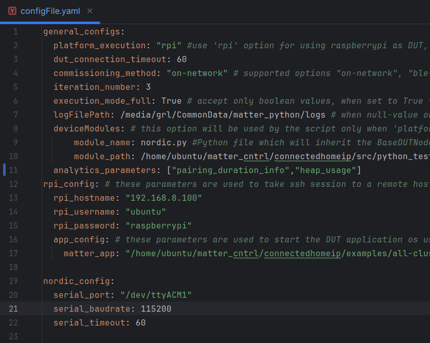
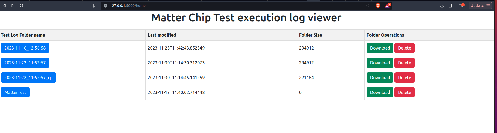
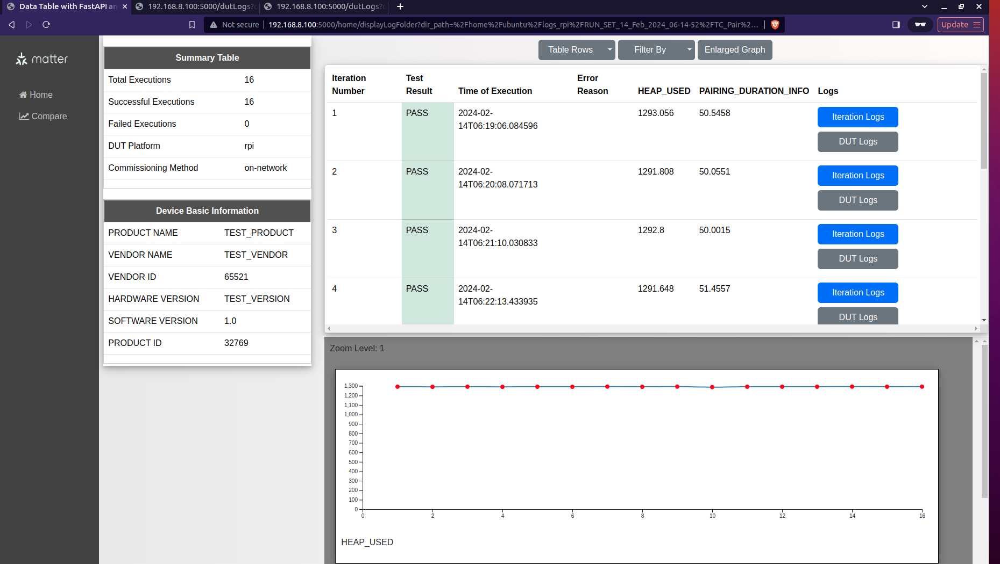
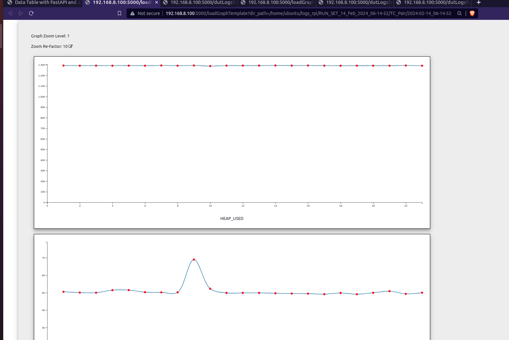
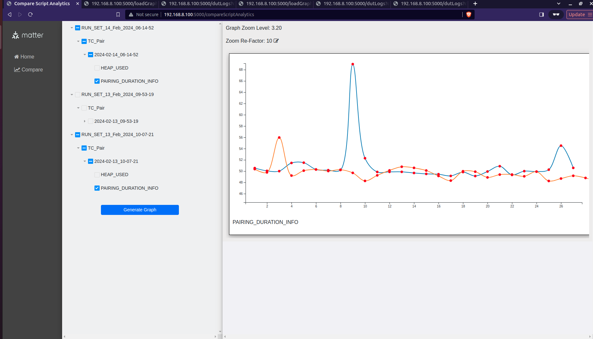

# Project Setup

This README provides comprehensive instructions for setting up and running the Python environment for the project. Below are the steps to follow:

## 🛠️ Environment Setup

### Cloning the Repository and Environment Activation

Clone the repository and activate the environment by executing the following commands:

```bash
git clone https://github.com/project-chip/connectedhomeip.git
cd connectedhomeip
source scripts/bootstrap.sh
source scripts/activate.sh
scripts/build_python.sh -m platform -d true -i <name_of_python_environment>
source <name_of_python_environment>/bin/activate
```

After activating the environment, copy the contents of this project to `<path_to_cloned_repo>/connectedhomeip/src/python_testing` and navigate to this path.

You can use commands like ```cp <path_to_this_project>/Functional/* <path_to_cloned_repo>/connectedhomeip/src/python_testing``` , and navigate by ```cd <path_to_cloned_repo>/connectedhomeip/src/python_testing``` 

### Library Installation

To install the necessary libraries, run:

```bash
python setup.py install
```

# 🏃 Running Test Script Reliability

The reliability scripts are located at `<path_to_cloned_repo>/connectedhomeip/src/python_testing/Matter_QA/Scripts/ReliabilityScripts`. 

## ConFig File Setup

Each script requires configurations detailed in `configFile.yaml` located at `<path_to_cloned_repo>/connectedhomeip/src/python_testing/Matter_QA/Config/`.



#### ✏️ General Configs


| Parameter               | Type      | Description                                                                                                                                                                                                                                                                                                                                                                                                                                   |
|:------------------------|:----------|:----------------------------------------------------------------------------------------------------------------------------------------------------------------------------------------------------------------------------------------------------------------------------------------------------------------------------------------------------------------------------------------------------------------------------------------------|
| `platform_execution`    | `string`  | DUT Platform Execution can be controlled here. If the user wants to use 'rapsberrypi' device as a DUT use ```rpi```,enabling this will make the script use the ```rpi_config``` and interact with the matter application present in the raspberrypi. Any other String used in this option will make the script use <br> ```deviceModules```, which will be respective user's DUT interaction class which they will have to implement and use. |
| `module_name`           | `string`  | As an example for `deviceModules` option we have added a DUT interaction script for Nordic dev board, which is `nordic.py`, user must give his own script name for other DUT intearction scripts                                                                                                                                                                                                                                              |
| `module_path`           | `string`  | corresponds to the path for the user's DUT interaction script                                                                                                                                                                                                                                                                                                                                                                                 |
| `commissioning_mthod`   | `string`  | Choosing the transport method for communicating with DUT can be controlled here, where it supports only three mode namely "on-network", "ble-wifi", "ble-thread".                                                                                                                                                                                                                                                                             |
| `iteration_number`      | `integer` | will be used by the script to run n number of times, as example take the "TC_Pair.py" script, if we want to pair and unpair from the device n number of time we need pass integers here to run n number of times.                                                                                                                                                                                                                             |
| `LogFilePath`           | `string`  | All the Logs for the script execution will be stored on the system and path will be specifed here, the user needs to create the path on the system, if it does not exist then current directory where the script is executing will be used for storing the Log Data.                                                                                                                                                                          |
| `analytical_parameters` | `array`   | By default the script will monitor two parameters heap usage and pairing_duration, this option is an empty array no parameter will be measured                                                                                                                                                                                                                                                                                                |

#### ✏️ Raspberry-pi config(rpi_config)

| Parameter      | Type     | Description                                                                            |
|:---------------|:---------|:---------------------------------------------------------------------------------------|
| `rpi_hotsname` | `string` | Here user will provide the raspberrypi <br/> Ip adderess                               |
| `rpi_username` | `string` | the user name of the Raspberrypi                                                       |
| `matter_app`   | `string` | full path and script name of the matter cluster application along with command options |


#### ✏️ Nordic serial config(nordic_config)
This option will be used by the `nordic.py` script to interact with Nordic dev board

| Parameter         | Type      | Description                                                                                |
|:------------------|:----------|:-------------------------------------------------------------------------------------------|
| `serial_port`     | `string`  | serial port path,example; for linux systems it will be `/dev/tty/ACM0`, for windows `COM1` |
| `serial_baudrate` | `integer` | Baudrate number                                                                            |
| `serial_timeout`  | `integer` | timeout for interacting with the nordic dev board                                          |

### ℹ️ About Test Script 'TC_Pair.py'

The scripts in the repository are used to pair and unpair with DUT multiple times. Currently, two simulated modes of DUT are assumed: Raspberry Pi and nRf52840-DK development thread board. The Raspberry Pi mode prompts the user for necessary inputs, while the nRf52840-DK mode requires the location of the script for advertising and resetting the DUT, among other functions.


### Raspberry Pi

Execute the following command to run the script, where inputs are read from the project's config file:

```bash
python3 TC_Pair.py --discriminator 3840 --passcode 20202021 --storage-path admin_storage.json --trace-to json:log
```

If running the code with the argument '--yaml-file', provide the path of the config file with the filename:

```bash
python3 TC_Pair.py --discriminator 3840 --passcode 20202021 --storage-path admin_storage.json --trace-to json:log --yaml-file /home/user/config.yaml
```

When running the code for 'ble-wifi' commissioning method,in the 'configFile.yaml' file the option for 'commissioning_method'
must be set to 'ble-wifi' and use the command below

```bash
python3 TC_Pair.py --discriminator 3840 --passcode 20202021 --storage-path admin_storage.json --trace-to json:log --wifi-ssid <wifi-name> --wifi-passphrase <wifi-password>
```

### Nordic Thread

For Nordic Thread, use the following command:

```bash
python3 TC_Pair.py --discriminator 3840 --passcode 20202021 --storage-path admin_storage.json --ble-interface-id 0  --thread-dataset-hex 0e080000000000010000000300001035060004001fffe0020812611111227222220708fd97e1eb459cbbf3051000112433428566778899aabbccddeeff030f4f70656e54687265616444656d6f63010212320410b775feb5fc41b965747da30c8f76bda30c0402a0f7f8
```

# LOG Display Web App


## 🚀 Execution Steps

Edit the config file located at `<path_to_cloned_repo>/connectedhomeip/src/python_testing/logDisplayWebApp/config/config.yaml` with desired configurations.

To run the application, navigate to `<path_to_cloned_repo>/connectedhomeip/src/python_testing/logDisplayWebApp` and execute:

```bash
python LogDisplay.py
```

Alternatively, pass a config file to the application:

```bash
python LogDisplay.py --config <path_to_config_file>/config.yaml
```

Access the homepage of the app at `http://host-name:port/home` once the app starts.


## 🖥️ About the Application

The LOG Display Web App serves as a visualization tool for users to check the pass and fail status of iterations. It reads a config file from the project directory for configurations.

### Features

- Displays all folders present in the LOG Directory.
- Allows downloading folders in 'zip' format or deleting directories.<br><br>
  <br><br>
- Provides tables with iteration summary, test result, execution time, and options to view DUT logs.
- Offers pagination for ease of data viewing.<br><br>
  <br><br>
- Includes analytics feature with line graphs for visualization.<br><br>
  <br><br>
- Supports comparison of analytics parameters against iteration numbers.<br><br>
  <br><br>


