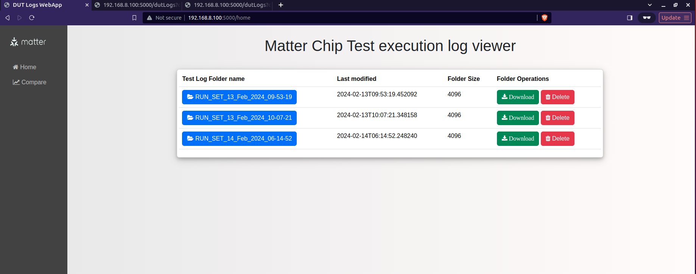
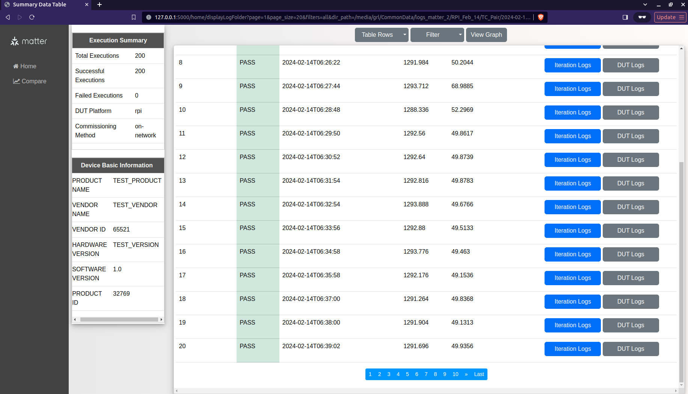

# Project Setup

This README provides comprehensive instructions for setting up and running the Python environment for the project. Below are the steps to follow:

## 🛠️ Environment Setup

### Cloning the Repository and Environment Activation

Clone the repository and activate the environment by executing the following commands:

```bash
git clone https://github.com/project-chip/connectedhomeip.git
cd connectedhomeip
source scripts/bootstrap.sh
source scripts/activate.sh
scripts/build_python.sh -m platform -d true -i <name_of_python_environment>
source <name_of_python_environment>/bin/activate
```

After activating the environment, move the contents from the root of this project to `<path_to_cloned_repo>/connectedhomeip/src/python_testing` and navigate to this path.

### Library Installation

To install the necessary libraries, run:

```bash
python setup.py install
```

The reliability scripts are located at `<path_to_cloned_repo>/connectedhomeip/src/python_testing/Matter_QA/Scripts/ReliabilityScripts`. 

Each script requires configurations detailed in `configFile.yaml` located at `<path_to_cloned_repo>/connectedhomeip/src/python_testing/Matter_QA/Config/`.

## 🏃 Running Test Script 'TC_Pair.py'

### Raspberry Pi

Execute the following command to run the script, where inputs are read from the project's config file:

```bash
python3 TC_Pair.py --discriminator 3840 --passcode 20202021 --storage-path admin_storage.json --trace-to json:log
```

If running the code with the argument '--yaml-file', provide the path of the config file with the filename:

```bash
python3 TC_Pair.py --discriminator 3840 --passcode 20202021 --storage-path admin_storage.json --trace-to json:log --yaml-file /home/user/config.yaml
```

### Nordic Thread

For Nordic Thread, use the following command:

```bash
python3 TC_Pair.py --discriminator 3840 --passcode 20202021 --storage-path admin_storage.json --ble-interface-id 0  --thread-dataset-hex 0e080000000000010000000300001035060004001fffe0020812611111227222220708fd97e1eb459cbbf3051000112433428566778899aabbccddeeff030f4f70656e54687265616444656d6f63010212320410b775feb5fc41b965747da30c8f76bda30c0402a0f7f8
```

## ℹ️ About Test Script 'TC_Pair.py'

The scripts in the repository are used to pair and unpair with DUT multiple times. Currently, two simulated modes of DUT are assumed: Raspberry Pi and nRf52840-DK development thread board. The Raspberry Pi mode prompts the user for necessary inputs, while the nRf52840-DK mode requires the location of the script `override.py` for advertising and resetting the DUT, among other functions.

# LOG Display Web App

## 🖥️ About the Application

The LOG Display Web App serves as a visualization tool for users to check the pass and fail status of iterations. It reads a config file from the project directory for configurations.

### Features

- Displays all folders present in the LOG Directory.
- Allows downloading folders in 'zip' format or deleting directories.<br><br>
  <br><br>
- Provides tables with iteration summary, test result, execution time, and options to view DUT logs.
- Offers pagination for ease of data viewing.<br><br>
  <br><br>
- Includes analytics feature with line graphs for visualization.<br><br>
  <br><br>
- Supports comparison of analytics parameters against iteration numbers.<br><br>
  <br><br>

## 🚀 Execution Steps

Edit the config file located at `<path_to_cloned_repo>/connectedhomeip/src/python_testing/logDisplayWebApp/config/config.yaml` with desired configurations.

To run the application, navigate to `<path_to_cloned_repo>/connectedhomeip/src/python_testing/logDisplayWebApp` and execute:

```bash
python LogDisplay.py
```

Alternatively, pass a config file to the application:

```bash
python LogDisplay.py --config <path_to_config_file>/config.yaml
```

Access the homepage of the app at `http://host-name:port/home` once the app starts.
